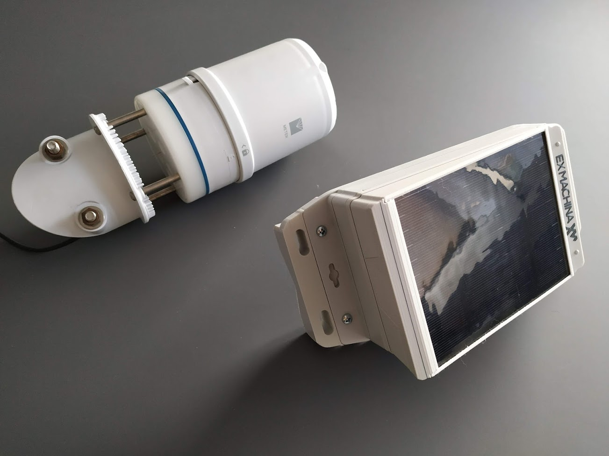
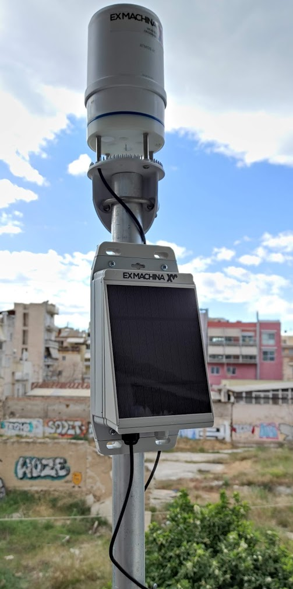

# Ex Machina IoT sensor node
  

## Features

- Energy autonomous - 2W solar panel and x2 18650 batteries
- Communication autonomous - GSM/LTE/NBIoT/WiFi/LoRa/BLE/GPS
- Multiple sensor protocols - SDI-12/UART/RF/PWM

## Weather station

- <a href="https://www.metergroup.com/environment/products/atmos-41-weather-station/" target="_blank">METER Group Atmos41</a>
- <a href="http://www.foshk.com/Weather_Professional/" target="_blank">Fine Offset all in one sensors</a>

## Soil moisture sensor

- <a href="https://www.metergroup.com/environment/products/teros-12/" target="_blank">METER Group Teros12</a>

## Water quality sensor

- <a href="https://in-situ.com/en/aqua-troll-600-multiparameter-sonde" target="_blank">in-situ aqua troll (400/500/600)</a>

## Water level sensor

- Any Maxbotix ultrasonic sensor (HRXL-MaxSonar-WR in PWM or UART mode)
- DFROBOT A02YYUW or A01NYUB (UART)

## PCB embedded sensors

- Bosch BME 280 (temperature, humidity, pressure)
- RTC temp sensor
